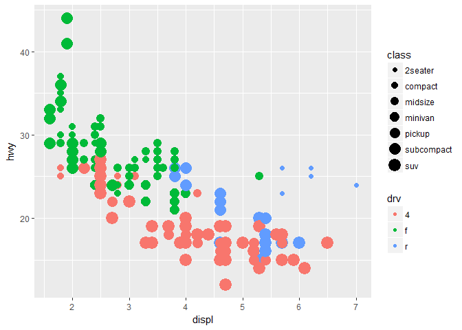

Seminar 2b
================

``` r
library(tidyverse)
```

    ## Warning: package 'tidyverse' was built under R version 3.3.3

    ## -- Attaching packages ---------------------------------- tidyverse 1.2.1 --

    ## v ggplot2 2.2.1     v purrr   0.2.4
    ## v tibble  1.4.1     v dplyr   0.7.4
    ## v tidyr   0.7.2     v stringr 1.2.0
    ## v readr   1.1.1     v forcats 0.2.0

    ## Warning: package 'ggplot2' was built under R version 3.3.3

    ## Warning: package 'tibble' was built under R version 3.3.3

    ## Warning: package 'tidyr' was built under R version 3.3.3

    ## Warning: package 'readr' was built under R version 3.3.3

    ## Warning: package 'purrr' was built under R version 3.3.3

    ## Warning: package 'dplyr' was built under R version 3.3.3

    ## Warning: package 'stringr' was built under R version 3.3.3

    ## Warning: package 'forcats' was built under R version 3.3.3

    ## -- Conflicts ------------------------------------- tidyverse_conflicts() --
    ## x dplyr::filter() masks stats::filter()
    ## x dplyr::lag()    masks stats::lag()

``` r
mpg
```

    ## # A tibble: 234 x 11
    ##    manufac~ model   displ  year   cyl trans  drv     cty   hwy fl    class
    ##    <chr>    <chr>   <dbl> <int> <int> <chr>  <chr> <int> <int> <chr> <chr>
    ##  1 audi     a4       1.80  1999     4 auto(~ f        18    29 p     comp~
    ##  2 audi     a4       1.80  1999     4 manua~ f        21    29 p     comp~
    ##  3 audi     a4       2.00  2008     4 manua~ f        20    31 p     comp~
    ##  4 audi     a4       2.00  2008     4 auto(~ f        21    30 p     comp~
    ##  5 audi     a4       2.80  1999     6 auto(~ f        16    26 p     comp~
    ##  6 audi     a4       2.80  1999     6 manua~ f        18    26 p     comp~
    ##  7 audi     a4       3.10  2008     6 auto(~ f        18    27 p     comp~
    ##  8 audi     a4 qua~  1.80  1999     4 manua~ 4        18    26 p     comp~
    ##  9 audi     a4 qua~  1.80  1999     4 auto(~ 4        16    25 p     comp~
    ## 10 audi     a4 qua~  2.00  2008     4 manua~ 4        20    28 p     comp~
    ## # ... with 224 more rows

``` r
ggplot(data = mpg) + 
  geom_point(mapping = aes(x = displ, y = hwy, size = class, color = drv))
```

    ## Warning: Using size for a discrete variable is not advised.



R Markdown
----------

This is an R Markdown document. Markdown is a simple formatting syntax for authoring HTML, PDF, and MS Word documents. For more details on using R Markdown see <http://rmarkdown.rstudio.com>.

When you click the **Knit** button a document will be generated that includes both content as well as the output of any embedded R code chunks within the document. You can embed an R code chunk like this:

``` r
summary(cars)
```

    ##      speed           dist       
    ##  Min.   : 4.0   Min.   :  2.00  
    ##  1st Qu.:12.0   1st Qu.: 26.00  
    ##  Median :15.0   Median : 36.00  
    ##  Mean   :15.4   Mean   : 42.98  
    ##  3rd Qu.:19.0   3rd Qu.: 56.00  
    ##  Max.   :25.0   Max.   :120.00

Including Plots
---------------

You can also embed plots, for example:


Note that the `echo = FALSE` parameter was added to the code chunk to prevent printing of the R code that generated the plot.
